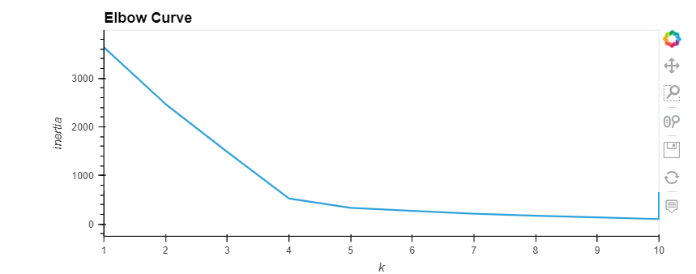
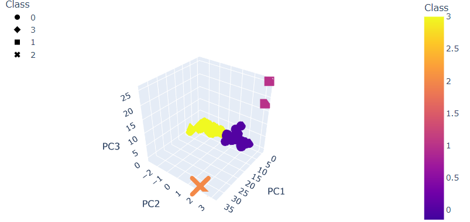
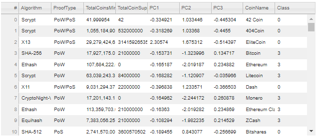
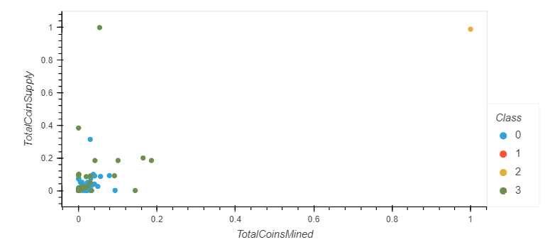

# Cryptocurrencies
## Overview
There is an interest from Accountability Accounting to offer a new cryptocurrency investment portfolio for its customers. The purpose of this project is to show a report that includes what cryptocurrencies are on the trading market and how they could be grouped to create a classification system for this new investment. The fact that the data will be working is not ideal and there is no known output for what Martha is looking for, she has decided to use unsupervised learning. The data wil be grouped on a clustering algorithm.

## Results

## Summary

It has been shown the visualization results based on similarities in the features. It will be up to the Accountability Accounting determine the performance and potential requierements based on specific goals from them.
